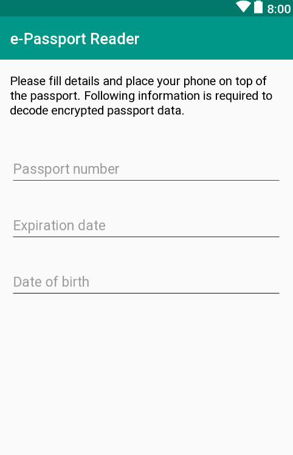
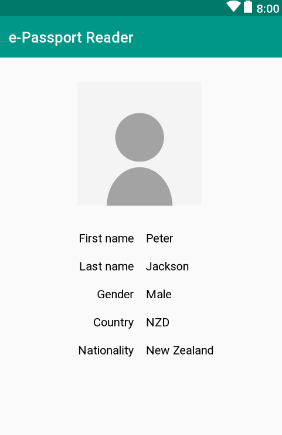

# About JMRTD

   JMRTD is a free implementation in Java of the Machine
   Readable Travel Document (MRTD) standards as specified
   by the International Civil Aviation Organization (ICAO).

   See the project's web site at https://jmrtd.org/.

## About this Project
   Android app that uses the NFC chip to communicate with an electronic passport. It supports action, so third party apps can use it to retrieve passport data. Please visit website for more information.
   
   The app is completely open source, so anyone is welcome to validate that it doesn't collect any personal information. Data is kept only in memory and removed as soon as you close the app. Passport data is never uploaded to any remote server.

## Dependencies

Note that the app includes the following third-party dependencies:

- JMRTD - [LGPL 3.0 License](https://www.gnu.org/licenses/lgpl-3.0.en.html)
- SCUBA (Smart Card Utils) - [LGPL 3.0 License](https://www.gnu.org/licenses/lgpl-3.0.en.html)
- Spongy Castle - MIT-based [Bouncy Castle Licence](https://www.bouncycastle.org/licence.html)
- JP2 for Android - [BSD 2-Clause License](https://opensource.org/licenses/BSD-2-Clause)
- JNBIS - [Apache 2.0 License](https://www.apache.org/licenses/LICENSE-2.0)
- Material DateTimepicker - [Apache 2.0 License](https://www.apache.org/licenses/LICENSE-2.0)

## Just Enter 
      Passport Number
      Expiration Date
      Date of Birth
 

## Desirable Output 

## Contact

   info@jmrtd.org.

## Contributors

[Anton Tananaev Open AI](https://github.com/tananaev)

   (and others I forget to mention here, ... sorry)

[Link to the Online Android Application](https://play.google.com/store/apps/details?id=com.tananaev.passportreader)

## License

   GNU Lesser General Public License

